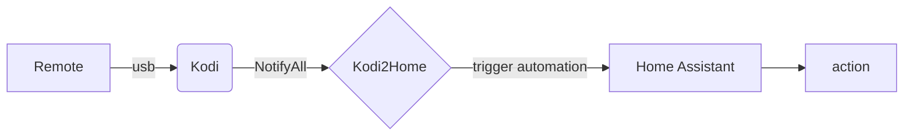
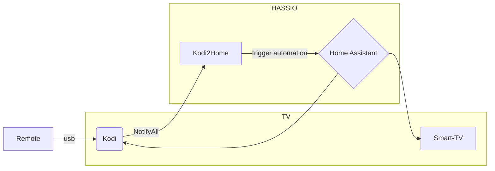

fork of DJJo14 Kodi2Home

Kodi2home
=========
In Home Assistant you can connect to Kodi and control Kodi from Home Assistant, but you cannot trigger an action when pressing a button on Kodi. This is where Kodi2home comes in to play. Kodi2home connects to the websocket from Kodi and to the websocket from Home Assistant. When it receives a "notifyall" from Kodi, it will trigger an automation on Home Assistant. In Kodi you change the keymap so that when you press a button it will send the "notifyall" message. This way you can turn on a light with the remote from Kodi. 

Note: When you change a button in the keymap of Kodi, it will override the existing function of that button. But you can control Kodi in your home assistant automation, and still do the same action. See [Example](#example)

# Install

You need the following things to make this work:
 - Home Assistant
 - Kodi
 - A USB remote connected to Kodi <BR>(IR or Bluetooth probably possible but not tested)
 - A way to change the keymap on Kodi <BR>
   (example: ssh into LibreELEC or notepad on Windows)
   
Install kodi2home by going to Settings -> Addon's -> Add-on store -> Vertical ... (upperright) -> repositories -> fill in the url: `https://github.com/goodlucknow/kodi2home`.

> **Note:** This is an optimized fork with improved reliability, faster reconnection (2-60s exponential backoff), and real-time message handling. See [CHANGELOG](kodi2home/CHANGELOG.md) for details.
After a refresh the Kodi2home is now in your add-on store. Click on it and press install. After installing you must configure the add-on in the configuration tab.
Example of the configuration:
```yaml
kodi_address: your kodi ip address
kodi_http_port: 8080
kodi_ws_port: 9090
kodi_username: your username
kodi_password: your password
home_address: 'ws://supervisor/core/api/websocket'
home_ssl: false
```

If you are using Home Assistant you do **not** need to change the home_address and home_ssl. The values are already set to the add-on values.

You need to change the keymap on Kodi. [More info about the keymap.](https://kodi.wiki/view/HOW-TO:Modify_keymaps) There is an "Add-on:Keymap Editor" but you cannot set it to send the NotifyAll message. So you need to change it in the keyboard.xml (or other .xml name).
Put something like this in your keymap of Kodi:
```xml
<volume_up>NotifyAll("kodi2home", "kodi_call_home", {"trigger":"automation.volume_up"})</volume_up>
```
Add an automation on Home Assistant with the id/name: "volume_up" (you can leave automation triggers empty). Start up the kodi2home add-on and press the volume_up button. The automation will be triggered on Home Assistant. Home Assistant will run your action that you put in your automation.

## Why
Home Assistant can control Kodi, but when you press a button on Kodi you cannot trigger an action on Home Assistant. Kodi2home is a man-in-the-middle. I found this a missing feature of Home Assistant. This way you can turn on a light with a Kodi remote, change the volume on your amplifier instead of Kodi, or do much smarter things.

## Why this way
With Kodi you can call scripts and with that do the same. For example call a script that calls a webtrigger. Because it has to start the script and then connect, it can be a sec later before the action is done. I created a video to see the difference. Watch closely to number change. Volume up is kodi2home and down is a script.
[](http://www.youtube.com/watch?v=MlcBf1nm40w)

## NotifyAll?
The hard part is to send out a message from kodi, without calling a script. Because calling a script from kodi takes almost 1 sec. This is where the NotifyAll comes in, this is a buildin message from kodi sending to all of the connected (web-)sockets. 

## How is it done
Kodi2home is not more than two websockets connected to each other. One side is lisening for the "NotifyAll" and the other side sending it to Home Assistant. Both of the websockets are already connected. So there is less delay there. 
The script is programed just like Home Assistant kodi intergration, so if it is liked, it can be intergated in to Home Assistant kodi intergration.

### Reload keymap
When you start the addon the keymap of kodi gets reloaded. So no need to restart all of kodi when changing the keymap(.xml), just restart the addon. 

## Known issue
Possibly fixed in 0.3.0, let me know. For some reason Home Assistant disconnects when you fire to may, automations at ones. And it response to that with a disconnect, i do not know a better way to then to just reconnect. 

# Example
This is a example how I use it:

The remote controls the Smart TV or Kodi depending on which source the TV gets its input from. This way you control Smart-TV apps (like Netflix) and Kodi with the same remote and the same buttons. 
In webos_example_automation.yaml is the example of the automations that switches the remote between kodi(at the HDMI) and the Smart-TV apps. This way you can control the tv with one remote. In webos_example_keymap.xml is the kodi keymap to use with a Measy remote.


Tip's, commands or spelling error's; just submit an issue.
>>>>>>> a6368d3 (Fix spelling and grammar errors throughout documentation and config)
